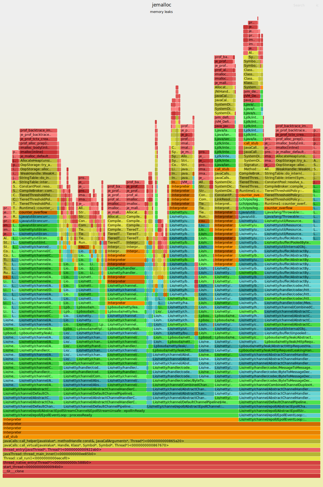
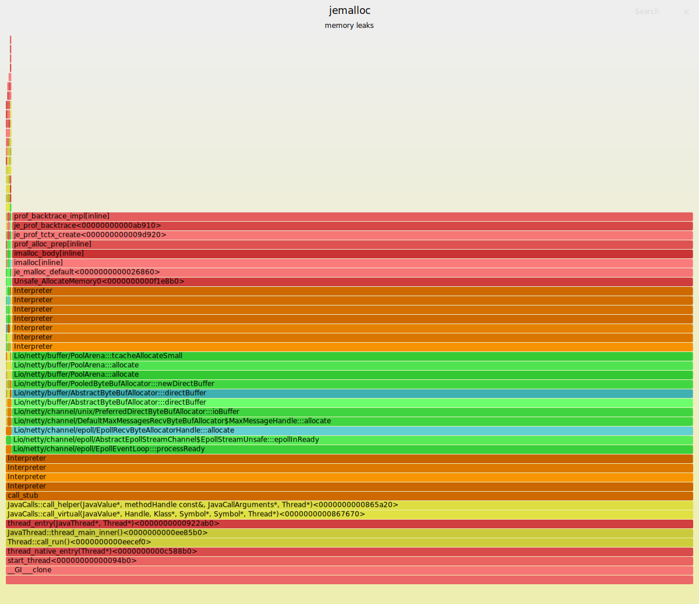

# netty-native-leak-flamegraph

- Based on this project:
- https://github.com/petrbouda/jvm-jemalloc-flamegraph

```
mvn package

# run the HTTP Server with Jemalloc settings 
MALLOC_CONF=prof_leak:true,lg_prof_sample:0,prof_prefix:/tmp/jeprof,prof_final:true \
java -XX:+UnlockDiagnosticVMOptions -XX:+DebugNonSafepoints -XX:+PreserveFramePointer \
-XX:+UseSerialGC -jar target/netty-leak.jar

# generate load
java src/main/java/pbouda/netty/leak/Client.java

# fetch DebugSymbols from Server JVM (before you stop the process)
create-java-perf-map.sh `pgrep -f netty-leak` unfoldall

# filter out all stacks that don't contain frame matching the pattern
java -jar jjf.jar --latest --filter .\*pbouda.\*
java -jar jjf.jar --latest --filter .\*netty.\*
```

- all stacks containing `pbouda` frames



- all stacks containing `netty` frames
- it looks like the allocations happened at the beginning of the program there are no Jitted versions of Intepreter's frames
